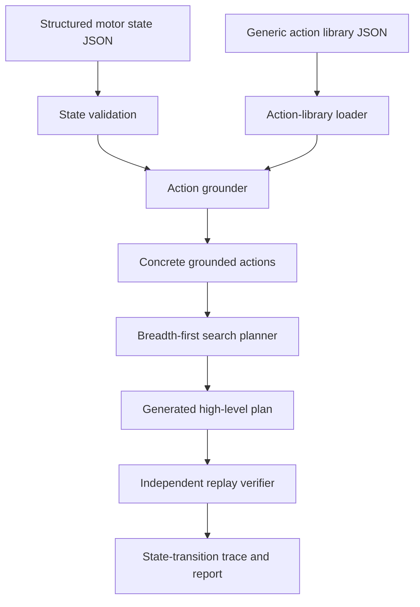

# Project Technical Update: Generic Actions, Incremental Replanning and Timing

**Project:** Symbolic Task Planning and Gazebo Visualisation for Simplified Electric Motor Disassembly  
**Update date:** 23 July 2026

## 1. Purpose of This Update

The previous prototype used motor-specific actions such as
`remove_end_cover_fasteners`. This worked for one predefined assembly, but the
same operation had to be written again for another component or fastener type.
It also represented the motor with flat Boolean fields such as
`end_cover_fasteners_present`, which could not distinguish fastener location,
size, drive type, quantity, or compatible tool.

The system has therefore been refactored around a reusable, parameterised
action library. The objective is not to model every industrial disassembly
operation. The objective is to provide a consistent set of high-level symbolic
operations that can be reused across different components, connection types,
fastener specifications, and available tools in simplified motor assemblies.

## 2. Summary of Implemented Changes

| Area | Previous implementation | Current implementation |
| --- | --- | --- |
| State model | Flat Boolean fields | Structured components, connections, tools and robot state |
| Action definitions | Motor-specific Python objects | Reusable templates stored in an external JSON library |
| Fastener handling | One action for a named motor location | One template instantiated for different locations and specifications |
| Tool handling | Exact tool name in each action | Capability and compatibility matching |
| Tool changes | Implicit | Explicit `change_tool` actions in the generated plan |
| Goal checking | Top-level Boolean fields | Nested goal matching, for example rotor status = collected |
| Trace | Mainly top-level fields | Nested field-level state transitions |
| State input | One complete predefined case | Partial observations merged over successive cycles |
| Planning cycle | One complete plan | Replan after each observation and apply one symbolic action |
| Completion | Predicted effect could satisfy goal | A subsequent observation must confirm the final goal |
| Timing | No structured measurement | Per-stage, per-cycle, total and repeated benchmark timing |
| Old implementation | Mixed with current source files | Archived under `planning_system/legacy/` and excluded from normal execution |

## 3. Current Program Workflow



The state JSON describes the current assembly instance. The action library
describes reusable operation rules. The action grounder combines them before
the planner searches for a valid sequence.

## 4. Why the Action Code Is Divided into Three Files

The current source directory contains three action-related modules, each with a
different responsibility.

### `action_library.py`: load and validate rules

This module reads the external JSON action library. It checks that every action
contains the required fields, such as its name, parameters, preconditions and
effects. It does not select motor components and does not perform planning.

### `action_template.py`: represent and evaluate rules

An `ActionTemplate` is a reusable operation definition with unbound parameters.
For example:

```text
remove_fastener(fastener, tool)
```

The template defines what must be true before the operation, how the tool is
checked, and how the symbolic state changes afterward. A `GroundedAction` is a
concrete version whose parameters have been filled with entity identifiers.

### `action_grounder.py`: bind rules to the current motor

The action grounder searches the state for components, connections and tools
that match each template. It checks type and tool compatibility, then creates
the concrete actions used by the BFS planner.

This separation keeps file loading, action semantics and instance-specific
matching independent. It also allows the action library to be changed without
editing the planner.

## 5. Structured Motor State

The current state is organised into four main areas:

```json
{
  "components": {
    "end_cover": {
      "type": "cover",
      "status": "installed",
      "accessible": true
    }
  },
  "connections": {
    "end_cover_screws": {
      "type": "threaded_fastener",
      "connects": ["end_cover", "housing"],
      "quantity": 4,
      "thread_size": "M4",
      "drive_type": "hex",
      "status": "installed",
      "accessible": true
    }
  },
  "tools": {
    "hex_driver_m4": {
      "capabilities": ["unscrew"],
      "thread_sizes": ["M4"],
      "drive_types": ["hex"],
      "available": true
    }
  },
  "robot": {
    "mounted_tool": "inspection_camera"
  }
}
```

The `connections` section is important because a component can be retained by
different mechanisms. A cover may be secured by threaded fasteners, clips,
adhesive or another connection type. The component-removal rule checks these
connections instead of relying on one component-specific Boolean field.

## 6. Example: One Fastener Rule, Two Applications

The generic library contains one `remove_fastener` template. Its main logic is:

```text
The fastener is installed
AND the fastener is accessible
AND the selected tool can unscrew
AND tool thread size matches fastener thread size
AND tool drive type matches fastener drive type
AND the selected tool is mounted
THEN set the fastener status to removed
```

From the current motor state, the grounder creates:

```text
remove_fastener[
  fastener=end_cover_screws,
  tool=hex_driver_m4
]
```

and later:

```text
remove_fastener[
  fastener=bearing_plate_screws,
  tool=phillips_driver_m3
]
```

The first action concerns four M4 hex screws on the end cover. The second
concerns three M3 Phillips screws on the bearing plate. No new Python action is
required for the second location.

The expected execution-time metadata can also depend on quantity. In the
current example:

```text
expected time = base time + quantity x per-fastener time
```

This estimated physical duration is kept separate from measured planner
computation time. Both values are reported with different units and labels.

## 7. Current Generic Operation Coverage

The external action library currently defines the following high-level
operations:

| Operation | Intended use |
| --- | --- |
| `change_tool` | Mount a required available tool |
| `inspect_component` | Mark an accessible component as inspected |
| `remove_fastener` | Remove compatible threaded fasteners |
| `release_retainer` | Release clips or retaining rings |
| `disconnect_connection` | Disconnect electrical or cable connections |
| `debond_joint` | Release an adhesive joint |
| `cut_connection` | Cut a rivet, welded joint or permanent joint |
| `remove_component` | Remove a released cover, plate, guard or housing part |
| `pull_component` | Pull an accessible bearing, rotor or shaft-type component |
| `collect_component` | Move a recovered target to the collection state |

These are symbolic task-level operations. They do not define robot
trajectories, grasp poses, forces or contact dynamics.

## 8. Planning and Verification

The BFS planner receives grounded actions rather than motor-specific action
code. At each search state it checks action preconditions, applies effects to a
copied state, rejects previously visited states, and stops when the nested goal
is satisfied.

The verifier then replays the selected plan from the initial state. It checks
the preconditions and tool requirements again, applies each effect, and confirms
that the final goal has been reached. This verification is independent of the
BFS search procedure, although the planner and verifier intentionally use the
same declared domain semantics.

## 9. Current Demonstration Result

The current case contains M4 end-cover screws, M3 bearing-plate screws, a cover,
a bearing plate, a rotor, and four relevant tools. The generated sequence is:

```text
change to M4 hex driver
-> remove end-cover screws
-> change to gripper
-> remove end cover
-> change to M3 Phillips driver
-> remove bearing-plate screws
-> change to gripper
-> remove bearing plate
-> change to rotor puller
-> pull rotor
-> change to gripper
-> collect rotor
```

Current verified result:

- planning success: `True`;
- plan length: 12 actions;
- visited symbolic states: 31;
- verifier result: `valid=True`;
- final rotor status: `collected`;
- current automated tests: 38 passed.

The result can be inspected in:

- `outputs/case_07_generic_motor_m3_m4_report.md`;
- `outputs/case_07_generic_motor_m3_m4_result.json`;
- `outputs/case_summary.md`.

## 10. Code and Data Organisation

```text
planning_system/
  src/planning_system/
    action_library.py
    action_template.py
    action_grounder.py
    planner.py
    verifier.py
    observation.py
    online_planner.py
    timing.py
    benchmark.py
    trace.py
    report.py
  data/
    generic_disassembly_action_library.json
    case_07_generic_motor_m3_m4.json
    goal_collect_generic_rotor.json
    stream_scenarios/
  tests/
  outputs/
  legacy/
    src/
    data/
    tests/
    outputs/
```

The old flat-state system and the superseded multi-file observation scenarios
are archived only to preserve development history. They are not imported by the
current package, selected by the UI, executed by the batch script, or included
in the current automated test run.

## 11. Meaning and Limits of Generality

The system is generic at the symbolic action-schema level. A single operation
can be reused for different entity identifiers, locations, fastener sizes,
connection types and compatible tools. The action semantics are still defined
in advance. This is intentional in transparent symbolic planning: the planner
searches over declared domain rules rather than learning new physical actions.

The motor state is also still provided as structured JSON. The current project
does not yet infer this state from camera images, CAD files or physical sensors.
Future perception or product-data modules could populate the same interface,
but they are outside the current implementation stage.

## 12. Observation-Driven Incremental Replanning

The second implementation stage replaces the assumption of one complete motor
state with a sequence of partial symbolic observations. Each test is now one
self-contained JSON stream containing the initial state, goal, action-library
reference and an ordered `observation_stream` array. Its frames simulate the
structured output that could later be produced by a perception module. They are
not raw camera images and the current project does not perform computer vision.

Each cycle now follows this sequence:

```text
read the next frame using the stream cursor
-> compare it with the previously predicted state
-> merge observed fields into the persistent known state
-> validate the updated state
-> ground the generic actions again
-> run BFS and verify the candidate plan
-> select and apply only the first action
-> wait for the next observation and replan
```

Only fields included in an observation are updated. Information already held in
the persistent state, such as available tools or previously removed parts, is
preserved unless the observation explicitly reports a different value.

The main scenario begins with only housing and tool information. The first
observation reveals the end cover and M4 screws. After cover removal, another
observation reveals the bearing plate and M3 screws. The target rotor is only
added to the known state after the bearing plate has been removed. After the
collection action, a thirteenth observation confirms the predicted final rotor
status. The system does not report final success before this confirmation.

## 13. Frontier Goals

When the rotor has not yet been observed, the final goal
`rotor.status=collected` cannot be reached by the currently grounded actions.
The system therefore constructs a transparent intermediate, or frontier, goal
from visible information.

Frontier goals are considered in this order:

1. inspect a visible component whose state must be confirmed;
2. release an accessible retaining connection;
3. remove or pull an accessible component after its retaining connections have
   been released.

Each frontier goal is still solved by BFS. The system does not bypass the
planner by directly selecting an arbitrary action. Once the rotor appears and
the final goal becomes reachable, planning switches to the final collection
goal.

## 14. Prediction and Observation Conflicts

After one selected action is applied, its symbolic effects form the expected
state for the next cycle. The next observation is compared only on fields it
reports. A newly revealed component is new information rather than a conflict.

If an existing field differs, the difference is recorded and the observed value
overrides the prediction. For example:

```text
expected: connections.end_cover_screws.status = removed
observed: connections.end_cover_screws.status = installed
```

The system then replans from `installed`. In the conflict test, it selects the
fastener-removal action again instead of assuming that the cover is released.

## 15. Timing Measurements

The system uses Python's monotonic high-resolution `perf_counter_ns` timer. It
records setup time and, for every cycle, observation loading, state merge,
action grounding, BFS planning, verification, first-action selection, symbolic
state update and complete cycle time. The report also records states visited by
the selected search, total states visited across all planning attempts,
cumulative planning time, the sum of cycle times and total experiment time.

These values measure software computation latency. They are separate from
`expected_action_time_s`, which estimates physical action duration. Individual
latency values vary between runs and machines. A repeated benchmark therefore
excludes warm-up runs and reports minimum, mean, median, P95 and maximum values.

## 16. Incremental Scenario Results

| Scenario | Purpose | Result |
| --- | --- | --- |
| `motor_stream_01_multilayer_m3_m4` | Progressive revelation of cover, bearing plate and rotor | 12 actions followed by one final confirmation frame; 11 replanning events and no mismatch |
| `motor_stream_02_clip_retainer` | End cover retained by a clip rather than screws | Reuses `release_retainer`, changes tools, removes the cover and confirms success |
| `motor_stream_03_prediction_conflict` | Observation contradicts predicted fastener removal | One mismatch recorded; observation overrides prediction and removal is replanned |
| `motor_stream_04_missing_m4_driver` | Required M4 hex driver is unavailable | Stops without proposing an incompatible tool or invalid action |
| `motor_stream_05_no_visible_frontier` | No useful component or connection is visible | Stops with an explicit no-reachable-frontier explanation |
| `motor_stream_06_adhesive_cover` | Bonded cover conceals a target rotor | Reuses `debond_joint`, removes the cover, extracts the rotor and confirms collection |

The successful scenario selects the same 12 high-level operations as the
complete-state case, but discovers and replans them across ordered frames in one
input stream rather than assuming one fixed plan at the beginning.

New implementation files:

- `observation.py`: partial updates, state merge and mismatch detection;
- `online_planner.py`: frontier goals and one-action-per-cycle execution;
- `timing.py`: per-stage timing;
- `benchmark.py`: repeated runs and descriptive timing statistics;
- `online_cli.py`: scenario execution and report output;
- `benchmark_cli.py`: configurable timing benchmark command;
- `data/stream_scenarios/`: six self-contained success and controlled-failure streams.

## 17. Repeated Timing Result

The main incremental scenario was executed for three excluded warm-up runs and
20 measured runs. All 20 measured runs reached the observation-confirmed goal.
On the current development machine, the results were:

| Metric | Mean | Median | P95 | Maximum |
| --- | ---: | ---: | ---: | ---: |
| Setup | 0.297 ms | 0.285 ms | 0.382 ms | 0.405 ms |
| Cumulative BFS planning | 64.552 ms | 64.548 ms | 65.658 ms | 66.453 ms |
| Complete experiment | 71.914 ms | 71.895 ms | 73.420 ms | 74.179 ms |

These measurements establish a reproducible software baseline for this case;
they do not establish hard real-time guarantees. The complete report and raw
per-run values are stored in:

- `outputs/timing/motor_stream_01_timing_benchmark.md`;
- `outputs/timing/motor_stream_01_timing_benchmark.json`.

## 18. Requirements Compliance Review

| Requirement | Current evidence | Status and boundary |
| --- | --- | --- |
| Reusable action library | Ten parameterised templates; M3 and M4 screws use one `remove_fastener` rule; other connection classes are tested | Implemented at symbolic task level |
| Different tools and compatibility | Capability, thread size, drive type, connection type and component type matching | Implemented for declared metadata |
| Partial input over successive steps | One stream contains thirteen ordered frames that are merged into a persistent state | Implemented with a cursor over simulated symbolic observations |
| Replan after each new input | Actions are grounded again, BFS reruns, the plan is verified, and only its first action is applied | Implemented |
| Prediction/observation conflict | Conflict scenario records the mismatch, trusts the observation and replans | Implemented |
| Final result confirmation | The final predicted effect requires a subsequent confirming observation | Implemented |
| Per-step and total timing | Setup, seven cycle stages, cumulative planning, cycle sum and experiment total are reported | Implemented for software computation |
| Repeated efficiency measurement | Warm-up exclusion and 20-run min/mean/median/P95/max report | Implemented as a baseline, not a real-time guarantee |
| Normal and failure tests | Six stream scenarios plus a documented ten-case fixed-state motor suite; 38 automated tests | Implemented for current scope |
| Physical robot or perception input | JSON observations use the interface expected from a future upstream module | Not implemented and not claimed |
| ROS 2 and Gazebo execution | Remain outside this modification stage | Not implemented in the current generic planner |

The implemented system therefore satisfies the agreed requirements for a
generic symbolic action layer, simulated observation-driven replanning,
independent plan replay, detailed timing and controlled test outputs. It does
not yet satisfy requirements that would depend on real perception, robot
motion, physical execution feedback or hard real-time deadlines.

## 19. Documented Motor Test Suite

Ten independent structured motor inputs have been added under
`data/test_cases/`. Every JSON file begins with a `test_case` section containing
the case title, situation, test focus and expected outcome. The suite covers:

1. M4 hex fasteners;
2. M3 Phillips fasteners;
3. a clip retainer;
4. a retaining ring;
5. an adhesive joint;
6. an electrical connector;
7. rivets;
8. simultaneous fastener and adhesive retention;
9. a missing compatible driver;
10. an invalid component reference.

Eight cases are expected to produce verified plans, one is expected to produce
a controlled planning failure, and one is expected to fail state validation.
Successful cases also declare the action templates that must appear in their
plans, so a case cannot pass merely by reaching the goal through an unintended
operation. All ten outcomes and required-template checks match expectations.
Each case has its own Markdown and JSON result under
`outputs/motor_test_cases/`, and the combined result is stored in
`motor_test_case_summary.md` in the same directory.

## 20. Current Position and Deferred Work

The current implementation is best described as **simulated
observation-driven online symbolic replanning**. It is not a real camera
pipeline and does not provide hard real-time deadline guarantees.

The current development focus is symbolic-system testing with broader motor
states, connection combinations and search spaces. Actual visual recognition,
physical robot execution, ROS 2 integration and Gazebo visualisation are
deliberately deferred. If resumed later, ROS 2 and Gazebo should consume only
plans that have passed the independent verifier and should not be presented as
physical validation of a disassembly operation.
